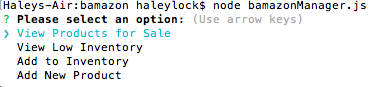
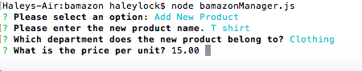

# bamazon
A Node.js & MySQL digital storefront. This is a command line Node app that mimics an online retailer.

## Description

This application implements a simple command line based storefront using the npm inquirer package and the MySQL database backend together with the npm mysql package. The application presents two interfaces: customer and manager.

#### Image Demo Manager

#### Home Screen

#### Add new Inventory 

